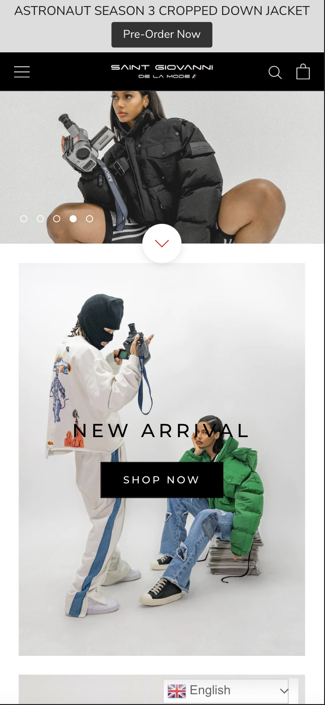
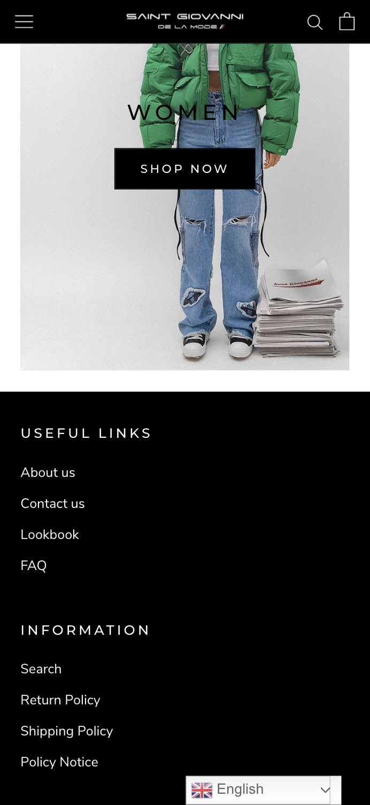
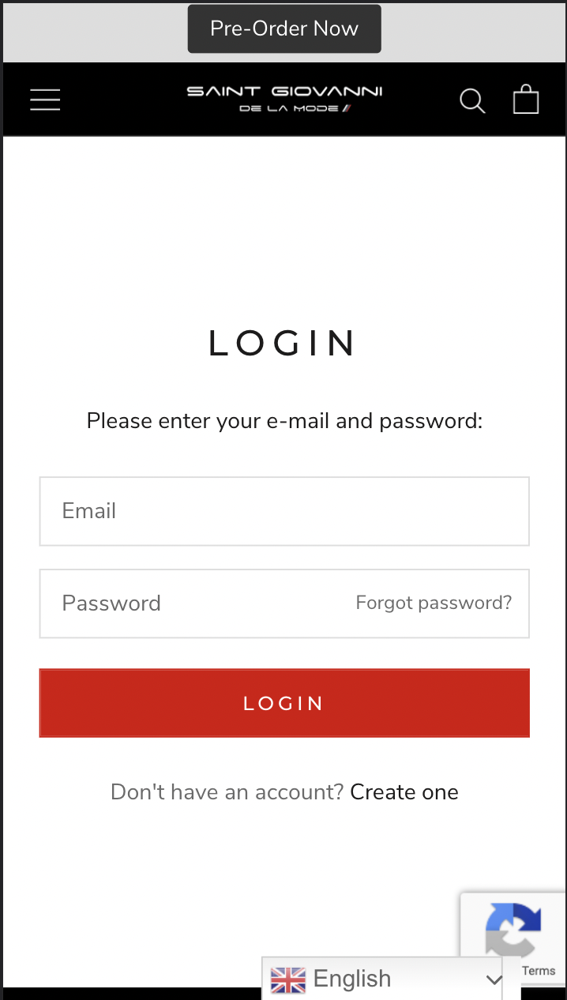
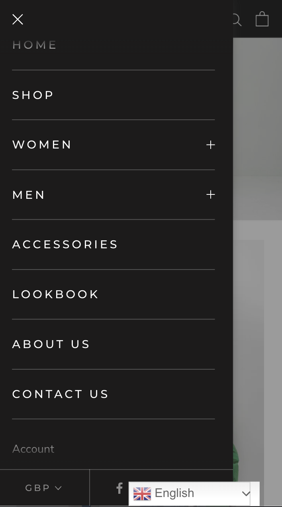

# Procesverslag
Markdown is een simpele manier om HTML te schrijven.  
Markdown cheat cheet: [Hulp bij het schrijven van Markdown](https://github.com/adam-p/markdown-here/wiki/Markdown-Cheatsheet).

Nb. De standaardstructuur en de spartaanse opmaak van de README.md zijn helemaal prima. Het gaat om de inhoud van je procesverslag. Besteedt de tijd voor pracht en praal aan je website.

Nb. Door *open* toe te voegen aan een *details* element kun je deze standaard open zetten. Fijn om dat steeds voor de relevante stuk(ken) te doen.

## Jij

  
uitwerken voor kick-off werkgroep

  ### Auteur:
  Quinny Breinburg

  #### Je startniveau:
  Blauw

  #### Je focus:
  Mijn focus ligt op de 'Surface Plane'. Voor deze opdracht wil ik de problemen oplossen die ik heb gevonden. Ik wil mijn best gaan 
  doen met het oplossen en er ook voor gaan zorgen dat de website dezelfde look en feel krijgt als de huidige website.
 

## Je website

  
uitwerken voor kick-off werkgroep

  ### Je opdracht:
  Saint Giovanni De La Mode - https://saintgiovani.co.uk/

  #### Screenshot(s) van de eerste pagina (small screen): 
  Home  
  
  

  #### Screenshot(s) van de tweede pagina (small screen):
  Account
 
  
  #### Screenshot(s) van een dynamische deel (small screen):
  Sidebar
 
 

## Toegankelijkheidstest 1/2 (week 1)

  
uitwerken na test in 1e werkgroep

  ### Bevindingen
  Lijst met je bevindingen die in de test naar voren kwamen:

  #### Screenreader
  Tijdens het gebruiken van de screenreader viel er mij niks op wat er veranderd kan worden. De kopjes, links etc. zijn te volgen. Ik had ook getest   of 
  het duidelijk zou zijn welke kleur een item zou zijn en dat is zo, want het wordt duidelijk aangegeven in de titel van de item.

  #### Muis en Toetsenbord 
  De website bedienen met je toetsenbord heb ik getest en eerst was het wennen, maar het is wel te doen. Er is een logische volgorde en plaatsing     van 
  knoppen/elementen wan wat je wilt gaan doen. Met de muis werken alle states van de elementen, zoals de hover en focus. Dus bij deze             
  toegankelijkheidstest heb ik geen problemen gevonden.

  #### Motoriek (shocks, elastiekjes)
  Met de shock-apparaat door de website heen scrollen was wel moeilijk om te doen, omdat het een soort terughoudend gevoel gaf. Er was afleiding, ik   
  ging mij focussen op de schokken inplaats van de website. Elke keer dat ik mijn hand/arm naar mijn laptop bracht, trok het zich vanzelf terug. Een   
  oplossing kan zijn om spraak toe te voegen, zodat mensen met een motoriek probleem makkelijk door de website heen kunnen.

  #### Visueel (brillen, contrast, kleurenblind, dark/light). 
  In mijn onderzoek ben ik erachter gekomen dat er geen dark mode is van de website, wat moeilijk kan zijn voor mensen die moeite hebben met fel       
  licht. Dus om die mensen te helpen ga ik een dark mode versie maken van de website.
  Ook heb ik getest hoe de website eruit ziet voor mensen met een slecht zicht. Zelf heb ik ook slecht zicht en draag ik een bril/lenzen en weet ik   hoe 
  het is om (bijna) niks te zien. Een oplossing daarvoor is om een knop toe te voegen waardoor alles groter wordt. 
  Daarna heb ik getest hoe het is om kleurenblind te zijn. En de enige oplossing waar ik nu op kan komen is wat de website al doet en dat is de       
  kleur van item in de titel zetten.

## Breakdownschets (week 1)

  
uitwerken na afloop 2e werkgroep

  ### de hele pagina: 
  

  ### dynamisch deel (bijv menu): 
  

  ### wellicht nog een dynamisch deel (bijv filter): 
  

## Voortgang 1 (week 2)

  
uitwerken voor 1e voortgang

  ### Stand van zaken
  hier dit ging goed & dit was lastig (neem ook screenshots op van delen van je website en code)

  ### Agenda voor meeting
  samen met je groepje opstellen

  | Julia             | Quinny             | Arron        | Britney          |
  | Grids en layouts  | Sidebar en lists   | Was er niet  | Was er niet      |

  ### Verslag van meeting
  hier na afloop snel de uitkomsten van de meeting vastleggen

  - Ik was als eerst aan de beurt. Ik kreeg complimenten over hoe mijn html code eruit zag.
  - Oplossing voor de sidebar had ik gekregen en mijn lists probleem ook.
  - Julia had oplossingen nodig voor haar artikelen die in grid/kolommen moesten, dat kreeg ze ook.
  - Beide onze vragen werden naar mijn gevoel goed beantwoord.

## Voortgang 2 (week 3)

  
uitwerken voor 2e voortgang

  ### Stand van zaken
  hier dit ging goed & dit was lastig (neem ook screenshots op van delen van je website en code)

  ### Agenda voor meeting
  samen met je groepje opstellen

  | Julia             | Quinny             | Arron              | Britney          |
  | Nav & dropdown    | Nav & dropdown     | Nav & dropdown     | Nav & dropdown   |
  |                   |                    | Borders grid       | H1 in sections   |
  |                   |                    | Responsive @media  |                  |

  ### Verslag van meeting
  hier na afloop snel de uitkomsten van de meeting vastleggen

  - Sanne had de nav en dropdown als eerst uitgelegd, omdat iedereen er behoefte aan had. Daarna had hij het ook gedeeld in Teams.
  - Daarna had hij de H1 voor Britney uitgelegd.
  - De 'Borders grid' en 'Responsive @media' zou Sanne apart aan Arron uitleggen, omdat het veel om uit te leggen was.
  
  BELANGRIJKE MEDEDELING

  Aan het eind van de feedbacksessie gaf de display van mijn laptop het op en kreeg ik alleen zwart scherm te zien. Dit heeft mijn voortgang voor drie 
  dagen stop gezet, want ik was radeloos en zocht ook naar oplossingen. Op mijn computer ben ik verder gaan werken, maar dat lukte dn ook weer niet wegens 
  device verschillen. Bij de tweede toegankelijkheidstest was dat ook te zien, want wat ik op mijn computer zag, was niet te zien op de laptop. Na de test 
  ben ik thuis gewoon gaan werken op mijn laptop met een externe scherm, zodat ik het weer goed kon krijgen en ben ik ook helemaal opnieuw begonnen. Ook 
  heb ik een derde toegankelijkheidstest thuis gedaan om weer op gang te komen.

## Toegankelijkheidstest 2/2 (week 4)

  
uitwerken na test in 8e werkgroep

 

  ### Bevindingen
  Lijst met je bevindingen die in de test naar voren kwamen (geef ook aan wat er verbeterd is):

  #### Screenreader
  De screenreader las alles goed voor en ook op een logische volgorde. Wat ik alleen niet moet vergeten is de alt tekst bij de afbeeldingen.

  #### Muis en Toetsenbord 
  De website bedienen met de toetsenbord ging goed. Er was een logische volgorde met welke kant de tab naartoe ging. Met de muis werken alle states van de 
  elementen, zoals de hover en focus. Een probleem dat ik nog wel heb is dat wanneer de sidebar open is, dat ik nog kan scrollen op de achtergrond. Ik heb 
  oplossing opgezocht, maar geen enkel werkt.

  #### Motoriek (shocks, elastiekjes)
  De pijltjes op de slides maakt het nu beter om door de afbeeldingen te gaan, inplaats van het handmatig sliden of door op de bolletjes te klikken. 

  #### Visueel (brillen, contrast, kleurenblind, dark/light). 
  De knoppen en tekst waren al duidelijk van de originele site, dus dat heb ik ook zo gehouden. Wat ik wel heb verbeterd en heb toegevoegd is bij de 
  slides. Ik heb pijlen toegevoegd en zwart gemaakt, zodat het goed te zien is. Ook heb ik de bolletjes van de slides duidelijker gemaakt door ze een 
  zwarte kleur te geven inplaats van een witte, want wit mengt mee met de meeste afbeeldingen. Dat is dus niet helder en duidelijk voor degenen met slecht 
  zicht. Ook heb ik een dark mode toegevoegd voor mensen die niet goed met blauw licht gaan.

## Voortgang 3 (week 4)

  
uitwerken voor 3e voortgang

  ### Stand van zaken
  hier dit ging goed & dit was lastig (neem ook screenshots op van delen van je website en code)

  ### Agenda voor meeting
  samen met je groepje opstellen

  | Julia             | Quinny             | Arron        | Britney          |
  | Buttons in        | Carousel en h2, a, | Media Query's| Buttons          |
  | carousel en nav   | logo button        | & ongelijke  | positioneren en  |
  | dropdown + resp.  | centreren          | grid         | aanroepen elem.  |
  
  ### Verslag van meeting
  hier na afloop snel de uitkomsten van de meeting vastleggen

  - Julia en ik waren nog tot over onze uur nog bezig met het krijgen van hulp.
  - De student-assistent heeft mij niet kunnen helpen met de carousel/slides, omdat hij daar zelf niet genoeg ervaring ermee heeft, zei hij.
  - Hij heeft mij wel kunnen helpen met het centreren van mijn h2 en op een image. Dit werd gedaan door een img in css te zetten inplaats van html.
  - Hij heeft Arron wel opweg kunnen helpen met zijn logo plaatsing wanneer de scherm breder wordt.
  - Britney's probleem met het positioneren werd snel opgelost. Ze moest de direct child oproepen en niet alle doormiddel van de '>' te zetten.

## Eindgesprek (week 5)

  
uitwerken voor eindgesprek

  ### Je uitkomst - karakteristiek screenshots:
  

  ### Dit ging goed/Heb ik geleerd: 
  Korte omschrijving met plaatjes

  

  ### Dit was lastig/Is niet gelukt:
  Korte omschrijving met plaatjes

  

## Bronnenlijst

  
continu bijhouden terwijl je werkt

  Nb. Wees specifiek ('css-tricks' als bron is bijv. niet specifiek genoeg).

  1. Dark mode: https://www.youtube.com/watch?v=9LZGB3OLXNQ
  2. Carousel: 
  3. Sidebar: 

